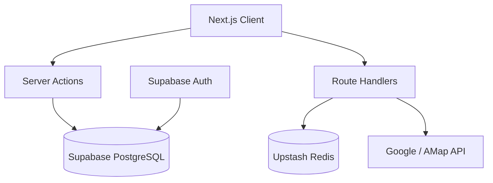

# PickStay 📍

> **Full-stack travel neighborhood recommender** | Next.js · TypeScript · Supabase · Redis

**Language:** [中文](README.md) | **English**

[](LICENSE)

## Live Demo

**Production:** https://pickstay.vercel.app

**Legacy (v1 static):** https://yiyuanlee.github.io/PickStay/ — pure front-end SPA; preferences live in `localStorage` (no login).

---

## Overview

PickStay helps travelers pick the best **neighborhood to stay in** using **7 preference weights** (safety, transit, food & shopping, nightlife, quiet, budget, café / chill). It supports live map POI enrichment, multi-neighborhood comparison, and cloud sync for signed-in users.

When planning a trip, *where* you stay often matters more than *which* hotel. Each area has its own character—bustling nightlife hubs, café-and-vintage-store walks, or quiet historic districts.

### Tech stack

| Layer | Stack |
|------|--------|
| Frontend | Next.js 16 App Router · React 19 · TypeScript · Tailwind CSS 4 |
| Backend | Next.js Route Handlers · Server Actions |
| Database | Supabase PostgreSQL + Row Level Security |
| Auth | Supabase Auth (Email + GitHub OAuth) |
| Cache | Upstash Redis (POI 24h TTL) |
| Testing | Vitest · Playwright · GitHub Actions CI |
| Deploy | Vercel + Supabase Cloud |

### Architecture



---

## Features

- **7-dimension ranking engine** — within-city normalization, SVG radar charts, match-driver explanations
- **Shareable preference deep links** — `?preset=` / `?w=` reproduce rankings without login; Dashboard one-click resume
- **Server-side map API proxy** — keys never hit the browser; concurrency pool, partial failures, IP rate limit, Redis 24h cache
- **User accounts** — preference / favorites / comparison sync with RLS
- **Admin panel** — city & neighborhood CRUD with surfaced errors; POI cache clear & warm
- **Mock fallback** — works out of the box without API keys using curated scores

Docs: [Structure](docs/STRUCTURE.md) · [Case Study](docs/CASE_STUDY.md) · [Interview Q&A](docs/INTERVIEW_QA.md) · [Demo script](docs/DEMO_SCRIPT.md) · [ADRs](docs/adr/)

### Repository layout

```
src/           # App (pages / components / lib)
config/        # ESLint · Vitest · Playwright
docs/          # Structure · contributing · case study · ADRs
supabase/      # Migrations + seed
tests/         # E2E
legacy/        # v1 archive
```

Full guide: [docs/STRUCTURE.md](docs/STRUCTURE.md). Contributing: [docs/CONTRIBUTING.md](docs/CONTRIBUTING.md).

### Covered cities (8 cities · 57 neighborhoods)

| City | Neighborhoods | Map provider |
|------|---------------|--------------|
| Tokyo | 8 | Google |
| Beijing | 7 | AMap |
| Paris | 7 | Google |
| Melbourne | 7 | Google |
| Queenstown | 7 | Google |
| Sydney | 7 | Google |
| Guangzhou | 7 | AMap |
| Osaka | 7 | Google |

---

## Quick start

### 1. Clone and install

```bash
git clone https://github.com/yiyuanlee/PickStay.git
cd PickStay
npm install
cp .env.example .env.local
```

### 2. Local development (no Supabase required)

Without env vars, the app uses built-in `src/data/cities.json`:

```bash
npm run dev
# open http://localhost:3000
```

### 3. Configure Supabase (full features)

1. Create a project on [supabase.com](https://supabase.com)
2. Run `supabase/migrations/001_initial_schema.sql`
3. Run `supabase/seed.sql` (or regenerate with `npm run seed:extract`)
4. Fill Supabase URL and keys in `.env.local`
5. Enable Email and GitHub OAuth in Supabase Auth

### 4. Map APIs and Redis (optional)

```env
GOOGLE_MAPS_API_KEY=...
AMAP_KEY=...
UPSTASH_REDIS_REST_URL=...
UPSTASH_REDIS_REST_TOKEN=...
```

---

## API endpoints

| Method | Path | Description |
|--------|------|-------------|
| POST | `/api/maps/enrich` | POI enrichment (Redis cache + mock fallback) |
| GET | `/auth/callback` | OAuth callback |

---

## Testing

```bash
npm run test          # Vitest unit tests
npm run test:e2e      # Playwright E2E
npm run typecheck     # TypeScript
npm run lint          # ESLint
npm run build         # Production build
```

---

## Deploy

### Vercel

1. Import the repo on [vercel.com](https://vercel.com)
2. Set env vars (see [docs/PRODUCTION.md](docs/PRODUCTION.md))
3. Deploy

After deploy, hit `/api/health` to verify service configuration.

### Render (alternative)

Use a Web Service and bind HTTP to `0.0.0.0:$PORT`.

---

## Portfolio / case study

See **[docs/CASE_STUDY.md](docs/CASE_STUDY.md)** for resume bullets, architecture decisions, and a demo recording guide.

**Suggested showcase:**
1. Live Demo link at the top of the README
2. 30s GIF: pick city → tweak weights → watch the heptagon → compare (save as `docs/demo.gif`)
3. Share-link OG preview (Twitter Card / Slack unfurl)
4. In interviews, open `/api/health` to walk through production readiness

---

## Directory tree

```text
PickStay/
├── legacy/                 # v1 static app (archive)
├── src/
│   ├── app/                # App Router pages & APIs
│   ├── components/         # React components
│   ├── data/               # Local fallback data
│   └── lib/                # Ranking, Supabase, Maps, Redis
├── config/                 # ESLint / Vitest / Playwright
├── supabase/
│   ├── migrations/         # Schema + RLS
│   └── seed.sql            # 8 cities · 57 neighborhoods
├── tests/                  # E2E
├── scripts/                # Data / ranking scripts
└── .github/workflows/      # CI
```

---

## Ranking formula

Preference weights \(W = \{W_1 \ldots W_7\}\) (0–10) and neighborhood scores \(S = \{S_1 \ldots S_7\}\) (1–10):

**Match Score = Σ(Wᵢ × Sᵢ) / (ΣWᵢ × 10) × 100**

By default, scores are min–max normalized **within the selected city** before weighting (see [ADR 002](docs/adr/002-scoring-normalization.md)).

---

## Resume bullets

> **PickStay** — Full-stack travel neighborhood recommender | Next.js, TypeScript, Supabase, Redis  
> **Live Demo:** https://pickstay.vercel.app

- Built a 7-dimension ranking engine across 8 cities / 57 neighborhoods with heptagon visualization and explainable match drivers
- Implemented Supabase Auth with RLS-backed preferences, favorites, and saved comparisons
- Shipped a server-side Maps proxy + Upstash Redis cache (keys never exposed) with mock fallback
- Vitest + Playwright + GitHub Actions CI; Vercel Analytics / Speed Insights

Chinese & English bullets: [docs/CASE_STUDY.md](docs/CASE_STUDY.md).

---

## Observability

| Capability | Status | Notes |
|------------|--------|--------|
| `/api/health` | ✅ Built-in | Checks Supabase / Redis / Maps / Sentry config |
| Vercel Analytics | ✅ Integrated | Auto-enabled on Vercel |
| Speed Insights | ✅ Integrated | Core Web Vitals |
| Sentry | Optional | Set `NEXT_PUBLIC_SENTRY_DSN` |

Production setup: [docs/PRODUCTION.md](docs/PRODUCTION.md).

---

## License

[MIT License](LICENSE)
