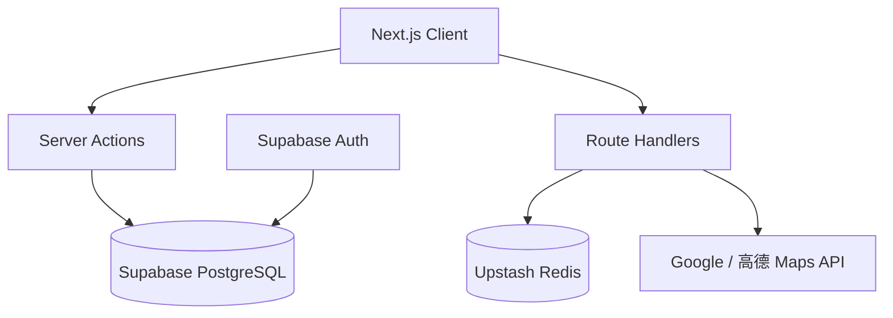

# PickStay 📍

> **全栈旅行住宿街区推荐平台** | Next.js · TypeScript · Supabase · Redis

[](LICENSE)

## Live Demo

**Production:** https://pickstay.vercel.app

**Legacy (v1 静态版):** https://yiyuanlee.github.io/PickStay/ — 纯前端 SPA，偏好存储在 `localStorage`，无需登录。

---

## 项目简介

PickStay 帮助旅行者通过 **7 维偏好权重**（安全、交通、美食、夜生活、安静、预算、咖啡/Chill）实时推荐最适合的城市宿区。支持地图 API 动态 POI 增强、多街区对比、用户云端同步。

在规划旅行时，选择**住在哪个区域**往往比选择「住哪家具体酒店」更为关键。每个街区都有它独特的性格——有些繁华喧嚣适合彻夜狂欢，有些充满独立咖啡店和古着店适合漫步，有些则是历史悠久的静谧居民区。
### 技术栈

| 层级 | 技术 |
|------|------|
| 前端 | Next.js 16 App Router · React 19 · TypeScript · Tailwind CSS 4 |
| 后端 | Next.js Route Handlers · Server Actions |
| 数据库 | Supabase PostgreSQL + Row Level Security |
| 认证 | Supabase Auth (Email + GitHub OAuth) |
| 缓存 | Upstash Redis (POI 24h TTL) |
| 测试 | Vitest · Playwright · GitHub Actions CI |
| 部署 | Vercel + Supabase Cloud |

### 架构



---

## 核心特性

- **7 维加权推荐引擎** — 8 城 57 街区实时排序，SVG 雷达图可视化
- **地图 API 服务端代理** — API Key 零暴露，Redis 缓存降低重复调用
- **用户体系** — 偏好云端同步、收藏、对比方案持久化 (RLS)
- **管理后台** — 城市/街区 CRUD、POI 缓存管理
- **Mock 降级** — 无 API Key 时使用本地预置评分，开箱即用

### 覆盖城市 (8 城 57 街区)

| 城市 | 街区数 | 地图服务商 |
|------|--------|------------|
| 东京 Tokyo | 8 | Google |
| 北京 Beijing | 7 | 高德 |
| 巴黎 Paris | 7 | Google |
| 墨尔本 Melbourne | 7 | Google |
| 皇后镇 Queenstown | 7 | Google |
| 悉尼 Sydney | 7 | Google |
| 广州 Guangzhou | 7 | 高德 |
| 大阪 Osaka | 7 | Google |

---

## 快速开始

### 1. 克隆并安装

```bash
git clone https://github.com/yiyuanlee/PickStay.git
cd PickStay
npm install
cp .env.example .env.local
```

### 2. 本地开发（无需 Supabase）

不配置环境变量时，应用自动使用内置 `src/data/cities.json` 本地数据：

```bash
npm run dev
# 访问 http://localhost:3000
```

### 3. 配置 Supabase（完整功能）

1. 在 [supabase.com](https://supabase.com) 创建项目
2. 运行 `supabase/migrations/001_initial_schema.sql`
3. 运行 `supabase/seed.sql`（或 `npm run seed:extract` 重新生成）
4. 填入 `.env.local` 中的 Supabase URL 和 Keys
5. 在 Supabase Auth 中启用 Email 和 GitHub OAuth

### 4. 配置地图 API 与 Redis（可选）

```env
GOOGLE_MAPS_API_KEY=...
AMAP_KEY=...
UPSTASH_REDIS_REST_URL=...
UPSTASH_REDIS_REST_TOKEN=...
```

---

## API 端点

| 方法 | 路径 | 说明 |
|------|------|------|
| POST | `/api/maps/enrich` | POI 动态增强（Redis 缓存 + Mock 降级） |
| GET | `/auth/callback` | OAuth 回调 |

---

## 测试

```bash
npm run test          # Vitest 单元测试
npm run test:e2e      # Playwright E2E
npm run typecheck     # TypeScript 检查
npm run lint          # ESLint
npm run build         # 生产构建
```

---

## 部署

### Vercel

1. 导入 GitHub 仓库到 [vercel.com](https://vercel.com)
2. 配置环境变量（参考 `.env.example`）
3. Deploy

### Render（备选）

使用 Web Service，确保绑定 `0.0.0.0:$PORT`。

---

## 目录结构

```text
PickStay/
├── legacy/                 # v1 纯前端版本（归档）
├── src/
│   ├── app/                # Next.js App Router 页面与 API
│   ├── components/         # React 组件
│   ├── data/               # 本地 fallback 数据
│   └── lib/                # 推荐引擎、Supabase、Maps、Redis
├── supabase/
│   ├── migrations/         # 数据库 Schema + RLS
│   └── seed.sql            # 8 城 57 街区种子数据
├── tests/                  # E2E 测试
├── scripts/                # 数据迁移脚本
└── .github/workflows/      # CI/CD
```

---

## 推荐算法

偏好权重向量 W = {W₁...W₇}（0-10），街区得分 S = {S₁...S₇}（1-10）：

**Match Score = Σ(Wᵢ × Sᵢ) / (ΣWᵢ × 10) × 100**

---

## 简历 Bullet Points 模板

> **PickStay** — 全栈旅行住宿街区推荐平台 | Next.js, TypeScript, Supabase, Redis
>
> - 设计并实现 7 维加权推荐引擎，支持 8 城 57 街区实时排序与 SVG 雷达图可视化
> - 构建 Supabase Auth 用户体系，实现偏好云端同步、收藏与对比方案持久化（RLS 行级安全）
> - 开发服务端 Map API 代理 + Upstash Redis 缓存层，减少 POI 重复查询，API Key 零暴露
> - 搭建 Admin 后台实现街区数据 CRUD；Vitest + Playwright 测试 + GitHub Actions CI/CD
> - 部署于 Vercel，Live Demo: [your-url.vercel.app]

---

## 监控（可选）

配置 `NEXT_PUBLIC_SENTRY_DSN` 环境变量即可接入 Sentry 错误监控。

---

## 开源协议

[MIT License](LICENSE)
